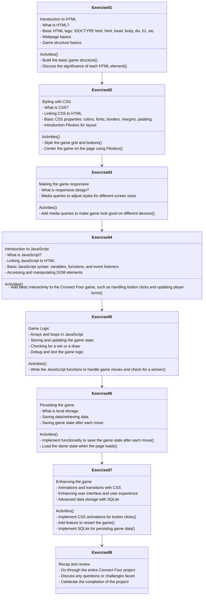

# Lesson 01: Connect Four

```mermaid
classDiagram 


    Exercise01 --> Exercise02
    Exercise02 --> Exercise03
    Exercise03 --> Exercise04
    Exercise04 --> Exercise05
    Exercise05 --> Exercise06
    Exercise06 --> Exercise07
    Exercise07 --> Exercise08
    

    Exercise01
    class Exercise01{
        Introduction to HTML
        - What is HTML?
        - Basic HTML tags: !DOCTYPE html, html, head, body, div, h1, etc
        - Webpage basics
        - Game structure basics
        Activities()
        - Build the basic game structure()
        - Discuss the significance of each HTML element()
    }

    Exercise02
    class Exercise02{
        Styling with CSS
        - What is CSS?
        - Linking CSS to HTML
        - Basic CSS properties: colors, fonts, borders, margins, padding
        - Introduction Flexbox for layout
        Activities()
        - Style the game grid and buttons()
        - Center the game on the page using Flexbox()
    }

    Exercise03
    class Exercise03{
        Making the game responsive
        - What is responsive design?
        - Media queries to adjust styles for different screen sizes
        Activities()
        - Add media queries to make game look good on different devices()
    }

    Exercise04
    class Exercise04{
        Introduction to JavaScript
        - What is JavaScript?
        - Linking JavaScript to HTML
        - Basic JavaScript syntax: variables, functions, and event listeners
        - Accessing and manipulating DOM elements
        Activities()
        - Add basic interactivity to the Connect Four game, such as handling button clicks and updating player turns()
    }


    Exercise05
    class Exercise05{
        Game Logic
        - Arrays and loops in JavaScript
        - Storing and updating the game state
        - Checking for a win or a draw
        Activities()
        - Write the JavaScript functions to handle game moves and check for a winner()
        - Debug and test the game logic
    }

    Exercise06
    class Exercise06{
        Persisting the game
        - What is local storage
        - Saving data/retrieving data
        - Saving game state after each move
        Activities()
        - Implement functionality to save the game state after each move()
        - Load the dame state when the page loads()
    }

    Exercise07
    class Exercise07{
        Enhancing the game
        - Animations and transitions with CSS
        - Enhancing user interface and user experience
        - Advanced data storage with SQLite
        Activities()
        - Implement CSS animations for button clicks()
        - Add feature to restart the game()
        - Implement SQLite for persisting game data()
    }

    Exercise08
    class Exercise08{
        Recap and review
        - Go through the entire Connect Four project
        - Discuss any questions or challanges faced
        - Celebrate the completion of the project!
    }


```
